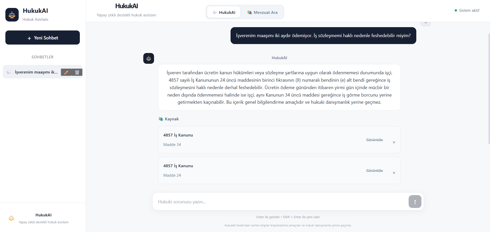

# ⚖️ HukukAI

HukukAI, Türk mevzuatı üzerinden kullanıcıların hukuki sorularına ilgili kanun maddelerini bularak kaynaklı yanıtlar üretmeyi amaçlayan RAG (Retrieval-Augmented Generation) tabanlı bir yapay zekâ uygulamasıdır.

## 🖥️ Uygulama Görünümü



## 🚀 Özellikler

- Türkçe hukuki soru-cevap sistemi
- RAG tabanlı mevzuat arama
- ChromaDB ile vektör tabanlı kaynak erişimi
- Sentence Transformers ile semantik arama
- Google Gemini ile kaynaklara dayalı cevap üretimi
- İlgili kanun ve madde numarasını kaynak olarak gösterme
- Birden fazla hukuki konuyu aynı soruda değerlendirebilme
- Hukuki dilekçe taslağı oluşturma
- Word ve PDF çıktısı oluşturma
- Web tabanlı kullanıcı arayüzü
- React Native ve Expo ile geliştirilen mobil uygulama
- Mobil cihaz üzerinden hukuki soru-cevap ve kaynak görüntüleme
- Mobil mevzuat arama
- Mobil uygulamada dilekçe oluşturma ve düzenleme
- Dilekçeleri Word ve PDF formatında oluşturma ve paylaşma

## 🛠️ Kullanılan Teknolojiler

### Backend
- Python
- FastAPI
- ChromaDB
- Sentence Transformers
- Google Gemini API

### Frontend
- React
- Vite
- JavaScript
- CSS

### Mobile
- React Native
- Expo
- TypeScript
- Expo Router
- Expo File System
- Expo Sharing

## 🧠 Sistem Yapısı

HukukAI temel olarak şu işlem sırasını kullanır:

1. Kullanıcının hukuki sorusu alınır.
2. Sorunun semantik niyeti analiz edilir.
3. İlgili mevzuat maddeleri ChromaDB üzerinden aranır.
4. En uygun kanun maddeleri seçilir ve sıralanır.
5. Seçilen kaynaklar Google Gemini modeline bağlam olarak gönderilir.
6. Model yalnızca sağlanan hukuki kaynaklara dayanarak cevap oluşturur.
7. Kullanılan kanun ve maddeler kullanıcıya kaynak olarak gösterilir.

## 📦 Backend Kurulumu

Backend klasörüne geçin:

```bash
cd backend
```

Gerekli Python paketlerini yükleyin:

```bash
pip install -r requirements.txt
```

`.env` dosyası oluşturun:

```env
GEMINI_API_KEY=YOUR_API_KEY
```

Backend'i başlatın:

```bash
python -m uvicorn main:app --reload
```

Backend varsayılan olarak:

```text
http://127.0.0.1:8000
```

adresinde çalışır.

## 💻 Frontend Kurulumu

Frontend klasörüne geçin:

```bash
cd frontend
```

Paketleri yükleyin:

```bash
npm install
```

Frontend'i başlatın:

```bash
npm run dev
```

Terminalde gösterilen yerel adresi tarayıcıda açın.

## 📱 Mobil Uygulama Kurulumu

Mobil uygulama React Native ve Expo kullanılarak geliştirilmiştir.

Mobil uygulama klasörüne geçin:

```bash
cd mobile
```

Gerekli paketleri yükleyin:

```bash
npm install
```

Expo geliştirme sunucusunu başlatın:

```bash
npx expo start
```

Terminalde oluşturulan QR kodu, aynı ağdaki mobil cihazda Expo Go uygulaması ile tarayarak HukukAI mobil uygulamasını çalıştırabilirsiniz.

Mobil uygulamanın backend ile iletişim kurabilmesi için FastAPI sunucusunu yerel ağ üzerinden erişilebilir şekilde başlatın:

```bash
python -m uvicorn main:app --reload --host 0.0.0.0 --port 8000
```

Mobil uygulama için `mobile/.env.example` dosyasını `.env` adıyla kopyalayın ve backend'in çalıştığı bilgisayarın yerel IP adresini girin:

```env
EXPO_PUBLIC_API_URL=http://YOUR_LOCAL_IP:8000
## 🔐 Güvenlik

Gemini API anahtarı kaynak kod içerisinde tutulmaz. API anahtarı `.env` dosyasında saklanır ve `.gitignore` aracılığıyla Git deposuna dahil edilmez.

## ⚠️ Uyarı

HukukAI tarafından üretilen cevaplar genel bilgilendirme amaçlıdır ve profesyonel hukuki danışmanlık yerine geçmez.

## 📌 Proje Amacı

Bu proje, büyük dil modelleri ile bilgi erişim sistemlerinin birlikte kullanılarak Türk hukuk mevzuatı üzerinde kaynaklandırılmış ve daha güvenilir yapay zekâ cevapları üretmesini araştırmak amacıyla geliştirilmiştir.